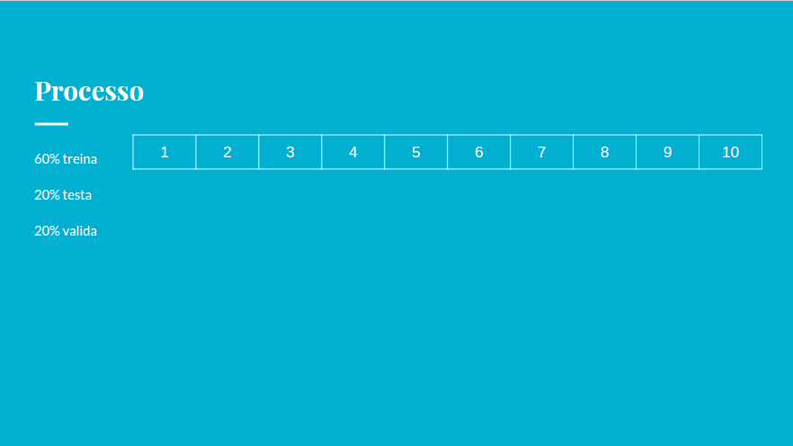

Todos os processos que realizamos até agora seguiram 3 passos, ou seja, primeiro pegamos mais de um algoritmo e pedimos para eles treinarem com determinados dados, e então, realizamos o mesmo teste para cada um deles. Por fim, verificamos qual dentre eles obteve o melhor resultado e o escolhemos como o algoritmo vencedor, isto é, o algoritmo que realiza a validação (teste do mundo real) e nos diz o resultado final que desejamos. Porém, vamos analisar melhor esses passos que realizamos para verificar se realmente é eficaz. Começaremos pelo treino, suponhamos que temos um conjunto de dados e que dividimos ele em:

Treino: 60%.
Teste: 20%.
Validação: 20%.

Considerando esse conjunto de dados, faremos a divisão dos mesmos da seguinte maneira:

Observe que foram utilizados 60% {1, 2, 3, 4, 5, 6} dos dados para treino, 20% {7, 8} para teste e mais 20% {9, 10} para validação. Então, quando rodamos esse algoritmo escolhemos o algoritmo vencedor e o seu resultado é de 82%. Aparentemente não temos nenhuma novidade do que já havíamos visto, porém, o que aconteceria se o nosso suposto cliente 5 não tivesse acessado naquele exato momento? Em outras palavras, suponhamos que esse cliente 5 ficasse doente e então aparecesse no lugar do cliente 7, o que aconteceria?

Repare que com essa simples alteração a nossa analise será totalmente diferente, mas por que será totalmente diferente? Pois a função fit não vai mais treinar com os dados {1, 2, 3, 4, 5 e 6} e sim com {1, 2, 3, 4, 6, 7}. Mas qual é o impacto que temos nesse cenário? Observe que, se o nosso treino for diferente, provavelmente o resultado será diferente, logo, poderemos utilizar um algoritmo diferente, e então, o resultado da nossa avaliação pode ser diferente, conforme o exemplo abaixo: